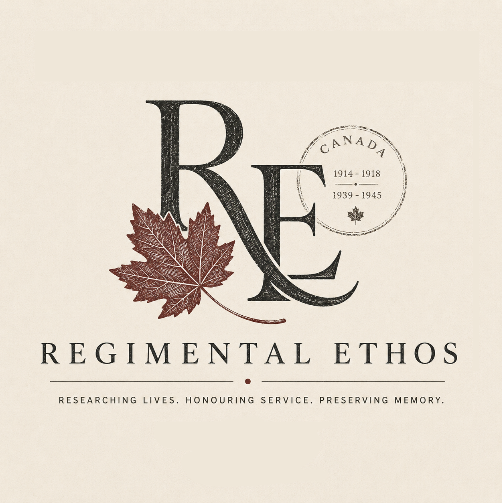

# Regimental Ethos

> Preserving the memory, service, and historical identity of Canadian soldiers of the First and Second World Wars through archival reconstruction and digital historical profiles.

---

## About

**Regimental Ethos** is a digital historical research initiative dedicated to reconstructing and publishing structured military profiles of Canadian servicemen who served during:

- World War I (1914–1918)
- World War II (1939–1945)

Our work combines:
- archival military research,
- genealogical reconstruction,
- operational military history,
- and digital humanities practices.

The objective is not merely to list names, but to restore historical context, unit identity, operational service, and individual trajectories.

---

## What We Publish

Each profile repository may include, whenever available:

- Military service summaries
- Unit histories
- War diary references
- Attestation papers
- Casualty forms
- Medal entitlement records
- Operational maps
- Census and genealogical records
- Grave and memorial information
- Timeline reconstructions
- Archival transcriptions
- Structured metadata for indexing

---

## Research Principles

Our work follows four core principles:

### 1. Archival Traceability
Every factual claim should be traceable to a primary or reputable secondary source.

### 2. Historical Precision
We avoid speculative reconstruction unless explicitly identified as hypothesis.

### 3. Contextualization
A soldier's service is interpreted within:
- unit structure,
- campaign chronology,
- operational movements,
- and historical circumstances.

### 4. Preservation over Romanticization
The goal is documentation and historical preservation — not myth-making.

---

## Inquiries & Correspondence

Every life of service leaves a record — but not every record tells a story.

At **Regimental Ethos**, we undertake careful historical research into the military lives and service of Canadian soldiers of the First and Second World Wars, assembling archival findings into memorial volumes intended to preserve family history with accuracy, dignity, and permanence.

Should you wish to inquire about our research process, discuss a prospective commemorative project, or request further information, correspondence is welcomed.

**Julio Cesar Torres**
Founder, Regimental Ethos

Québec, QC, Canada

Email: juliozohar@gmail.com
Telephone: 581-307-7882

Please include, where possible, the soldier’s full name, date of birth and any known details of service, regiment, or dates, so that an initial assessment may be undertaken with due care.

*Honouring service through research. Preserving memory through record.*
